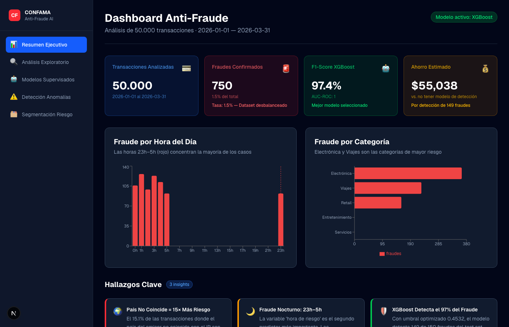
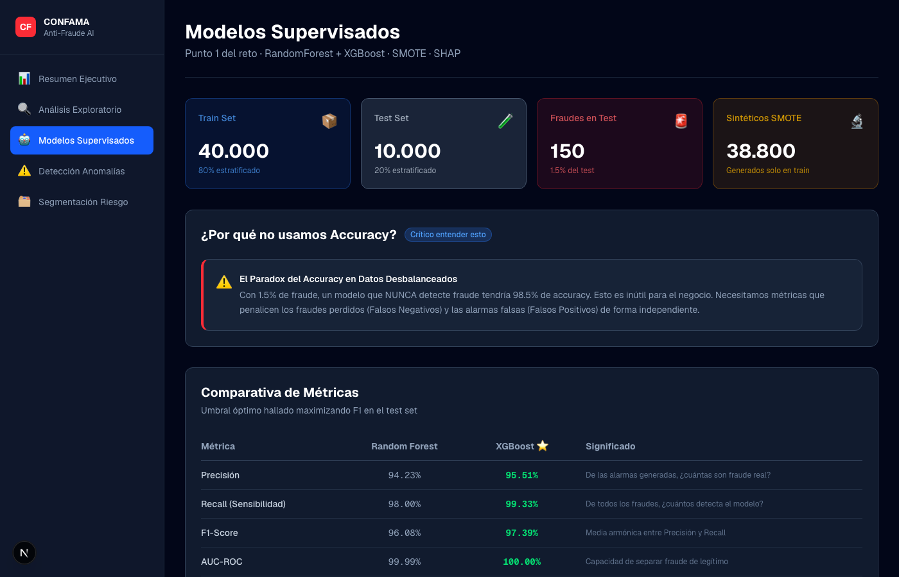
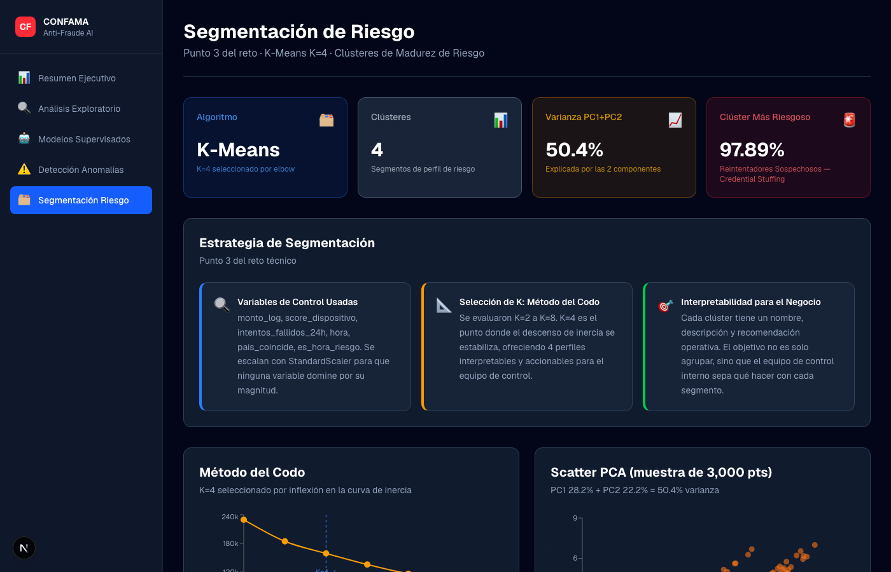

# Detección de Fraude — Challenge Técnico CONFAMA

Sistema completo de detección de fraude financiero sobre 50.000 transacciones (~1,5 % fraude). Pipeline de análisis en Python + dashboard interactivo en Next.js.

**[Dashboard en vivo](https://fraud-dashboard-lemon.vercel.app)** · **[Pitch interactivo](https://fraud-dashboard-lemon.vercel.app/pitch)**

---

## 🎮 Demo del Pitch Interactivo (RPG)


---

## Demo

### Dashboard principal



### Modelos supervisados (RF + XGBoost + SHAP)



### Segmentación de riesgo (KMeans K=4)



---

## Estructura del proyecto

```
├── Ejercicio Fraude.csv          # Dataset original (50 K transacciones)
├── python/                       # Pipeline de análisis ML
│   ├── analyze.py                # Script principal — ejecuta todos los módulos
│   ├── requirements.txt
│   ├── modules/
│   │   ├── preprocessing.py      # Feature engineering e imputación estratificada
│   │   ├── eda.py                # Análisis exploratorio
│   │   ├── supervised.py         # Random Forest + XGBoost + SHAP
│   │   ├── unsupervised.py       # Isolation Forest
│   │   └── clustering.py         # KMeans K=4 por nivel de riesgo
│   └── outputs/                  # JSONs generados (copiados al dashboard)
├── fraud-dashboard/              # Dashboard Next.js
│   ├── src/app/(dashboard)/      # Rutas: EDA, Modelos, Anomalías, Clustering
│   ├── src/components/           # Charts (Recharts) + Cards
│   ├── src/lib/dataLoader.ts     # Lectura server-side de los JSONs
│   ├── src/types/fraud.ts        # Tipos TypeScript — contrato con Python
│   └── public/data/              # Copia de los JSONs de python/outputs/
└── notebooks/                    # Versiones Colab para presentación
    ├── 01_preprocesamiento_eda.ipynb
    ├── 02_modelos_supervisados.ipynb
    ├── 03_deteccion_anomalias.ipynb
    └── 04_clustering_riesgo.ipynb
```

---

## Ejecución local

### 1. Pipeline Python

```bash
pip install -r python/requirements.txt

# Tarda 3–5 min por el cálculo de SHAP
cd python && python analyze.py
```

Genera `python/outputs/{eda,models,anomalias,clustering}.json` y los copia automáticamente a `fraud-dashboard/public/data/`.

### 2. Dashboard

```bash
cd fraud-dashboard
npm install
npm run dev
```

Abre [http://localhost:3000](http://localhost:3000).

> Los JSONs ya están incluidos en el repositorio — el dashboard funciona sin ejecutar el pipeline primero.

---

## Metodología

| Módulo | Técnica | Detalle |
|---|---|---|
| Preprocesamiento | Imputación estratificada | Mediana por `(pais_coincide, categoria_comercio)` para `score_dispositivo` |
| EDA | Estadística descriptiva | Distribuciones, correlaciones, tasas de fraude por segmento |
| Supervisado | RF + XGBoost | Split 80/20 estratificado, SMOTE solo en train, umbral óptimo por F1 |
| Anomalías | Isolation Forest | Contaminación estimada por regla IQR — sin uso del target en entrenamiento |
| Clustering | KMeans K=4 | Clusters reordenados por tasa de fraude ascendente (C0 = menor riesgo) |

---

## Resultados principales

| Métrica | Random Forest | XGBoost |
|---|---|---|
| Precisión | 94.23% | **95.51%** |
| Recall | 98.00% | **99.33%** |
| F1-Score | 96.08% | **97.39%** |
| AUC-ROC | 99.99% | **100.00%** |

- **Top features (SHAP)**: `score_dispositivo`, `intentos_fallidos_24h`, `monto_estandarizado`
- **Isolation Forest**: detecta el ~74 % de fraudes reales sin conocer el target en entrenamiento
- **Clustering**: 4 perfiles de riesgo con tasas de fraude 1 % → 97.89 %

---

## Stack

- **Python**: pandas, scikit-learn, xgboost, imbalanced-learn, shap
- **Dashboard**: Next.js 15, TypeScript, Tailwind CSS, Recharts
- **Notebooks**: Google Colab
